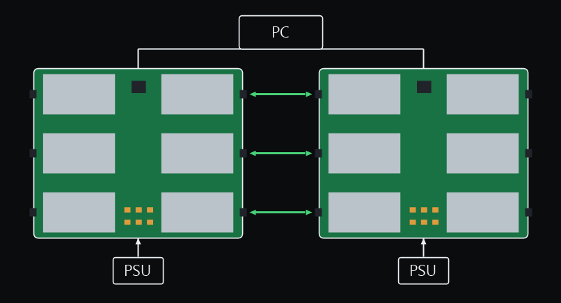
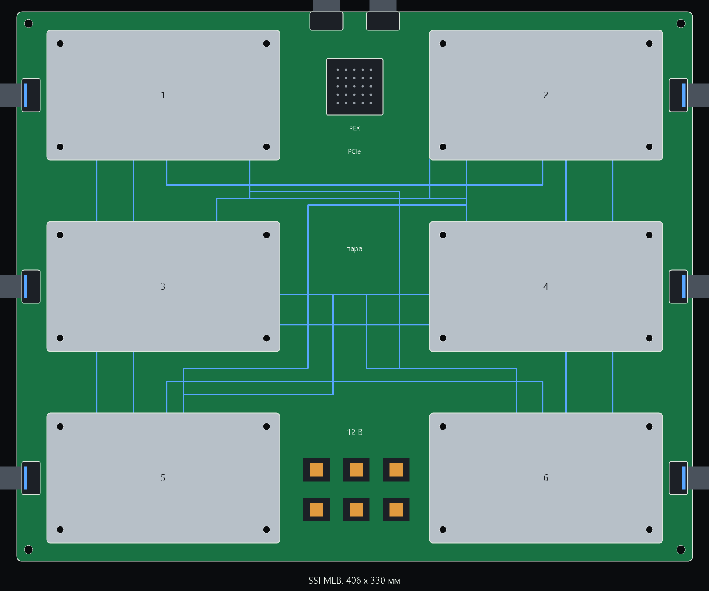

# OpenSXM

Open V100 SXM2 boards: five GPUs on a card, NVLink pass-through to the next card.

Домашняя цепочка дешёвых V100 SXM2 32 ГБ. Без салазки DGX, без NVSwitch и без заводской распиновки.

На одной плате пять чипов. Четыре линка NVLink из шести связывают их между собой, два оставшихся смотрят на предыдущую и следующую плату. Плат в цепочке до шести. Модель режется по слоям: плата — ступень конвейера. Цель цепочки — DeepSeek-R1 671B в Q6 или Q8, около пяти агентов сразу.

Четыре линка NVLink из шести связывают их между собой. Зелёные стрелки — линки к соседней плате. Сверху один компьютер, снизу питание каждой платы.

Плата повторяет контур SSI MEB, 406 × 330 мм. Четыре модуля лежат по углам, центральный тоже лежит. Питание внизу между чипами, PCIe сверху. Синие линии — четыре линка на плате, разъёмы по бокам смотрят на соседнюю плату.

## Шесть чипов, пара

На одной плате шесть чипов. Пять линков NVLink из шести связывают каждый чип с остальными на этой плате. Шестой линк выходит на ближний торец: левый столбец налево, правый направо.

Две платы соединяются парой. На рисунке они стоят рядом: зелёные стрелки — три линка ближнего столбца, по одному с каждого ряда. Ещё три линка с дальнего торца идут на ту же соседнюю плату, когда платы стоят одна за другой. Вместе это шесть линков между парой. Сверху один компьютер, снизу питание каждой платы.

Плата повторяет контур SSI MEB, 406 × 330 мм. Чипы стоят двумя столбцами по три. Питание внизу между нижними чипами, PCIe сверху. Синие линии — линки внутри платы, разъёмы по бокам смотрят на парную плату.

## Семь чипов

На одной плате семь чипов. Все шесть линков NVLink каждого чипа остаются на плате. Соседней платы нет: это полный граф, 21 линк.

Плата 500 × 312 мм. В среднем ряду три модуля, по краям по два. Контур шире SSI MEB: три модуля по 140 мм в один ряд на 406 мм не встают. Питание внизу между нижними чипами, PCIe сверху. Синие линии — линки внутри платы.

## Порядок

1. Таблица одного линка с двойной V100-карты.
2. Плата на два чипа, на ней линк должен обучиться.
3. Одна пятёрка без соседей, на ней модель класса 70B.
4. Цепочка плат и R1.

Пока двойная карта не прозвонена, пинов в репозитории нет. Угаданная распиновка убивает модуль.

## Что это за сокет

Только SXM2: P100 и V100, NVLink 1.0 и 2.0, 300 Вт, 12 В. SXM3 и новее — другие модули, другое питание и другие разъёмы. Идея пятёрки и цепочки на них может повториться только новой платой.
