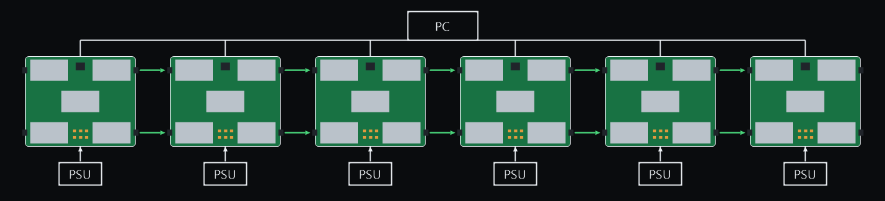
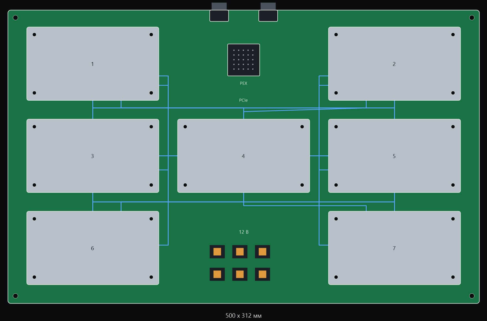

# OpenSXM

Open V100 SXM2 boards: five GPUs on a card, NVLink pass-through to the next card.

Домашняя цепочка дешёвых V100 SXM2 32 ГБ. Без салазки DGX, без NVSwitch и без заводской распиновки.

На одной плате пять чипов. Четыре линка NVLink из шести связывают их между собой, два оставшихся смотрят на предыдущую и следующую плату. Плат в цепочке до шести. Модель режется по слоям: плата — ступень конвейера. Цель цепочки — DeepSeek-R1 671B в Q6 или Q8, около пяти агентов сразу.

Четыре линка NVLink из шести связывают их между собой. Зелёные стрелки — линки к соседней плате. Сверху один компьютер, снизу питание каждой платы.

Плата повторяет контур SSI MEB, 406 × 330 мм. Четыре модуля лежат по углам, центральный тоже лежит. Питание внизу между чипами, PCIe сверху. Синие линии — четыре линка на плате, разъёмы по бокам смотрят на соседнюю плату.

## Порядок

1. Таблица одного линка с двойной V100-карты.
2. Плата на два чипа, на ней линк должен обучиться.
3. Одна пятёрка без соседей, на ней модель класса 70B.
4. Цепочка плат и R1.

Пока двойная карта не прозвонена, пинов в репозитории нет. Угаданная распиновка убивает модуль.

## Что это за сокет

Только SXM2: P100 и V100, NVLink 1.0 и 2.0, 300 Вт, 12 В. SXM3 и новее — другие модули, другое питание и другие разъёмы. Идея пятёрки и цепочки на них может повториться только новой платой.
